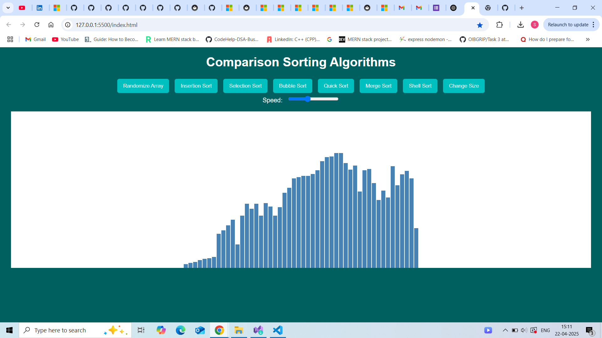

# Sorting Algorithm Visualizer 🧠📊

This project is a visual representation of various **comparison-based sorting algorithms** using **JavaScript, HTML, and CSS**. It dynamically displays bars that represent array elements and shows how each algorithm sorts them step-by-step.

## 🔧 Features

- 🔀 **Randomize Array**: Generates a new array of random heights
- 📉 **Sorting Algorithms Implemented**:
  - Insertion Sort
  - Selection Sort
  - Bubble Sort
  - Quick Sort
  - Merge Sort
  - Shell Sort
- 🔁 **Change Size**: Shrinks the bars to visualize smaller data
- ⚡ **Adjustable Animation Speed** using a slider

## 📸 Screenshot

  


## 🛠 Tech Stack

- **HTML**
- **CSS**
- **JavaScript (Vanilla)**

## 🚀 Getting Started

1. Clone the repository:
   ```bash
   git clone https://github.com/yourusername/sorting-visualizer.git
   cd sorting-visualizer
